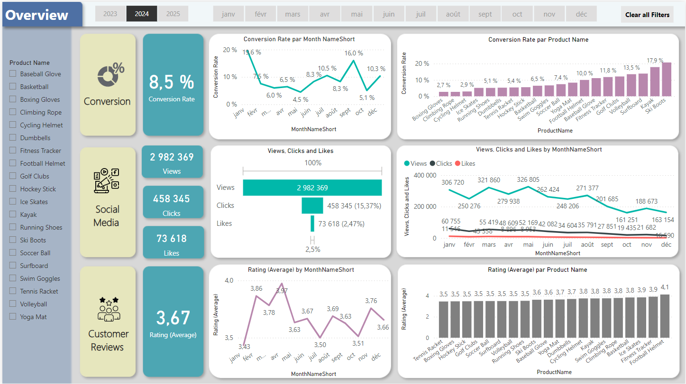

 # Project: Solving Business Problems with Power BI, SQL & Python

This project aims to tackle various business challenges by leveraging data analysis and visualisation techniques with Power BI, SQL, and Python. The goal is to clean, analyse, and visualise data to derive actionable insights that can inform business decisions and drive performance improvements. The project covers several key areas, including data cleaning, sentiment analysis, interactive dashboard creation, and effective presentation of insights.

# ShopEasy Marketing Analytics

## Overview

**ShopEasy** is an online retail business that has been facing challenges in increasing customer engagement and conversion rates despite launching various marketing campaigns. The company seeks detailed analysis and actionable insights to improve its marketing strategies and optimise its performance.

## Business Challenges

- **Reduced Customer Engagement:** The interactions and engagement levels with the website and marketing content have decreased.
- **Decreased Conversion Rates:** There has been a decline in the number of site visitors who convert into paying customers.
- **High Marketing Expenses:** Significant investments in marketing campaigns are not yielding the expected returns.
- **Need for Customer Feedback Analysis:** Customer feedback on products and services is crucial for improving engagement and conversion rates.

## Goals

### 1. **Increase Conversion Rates**
- **Goal:** Identify factors impacting the conversion rate and provide recommendations to improve it.
- **Insight:** Analyse the user journey to highlight key stages where visitors drop off. Provide actionable recommendations to optimize the conversion funnel.

### 2. **Enhance Customer Engagement**
- **Goal:** Determine which types of content drive the highest engagement.
- **Insight:** Analyse interaction levels with various types of marketing content and provide suggestions for improving content strategy.

### 3. **Improve Customer Feedback Scores**
- **Goal:** Understand recurring themes in customer reviews and provide actionable insights.
- **Insight:** Identify common positive and negative feedback to guide improvements in products and services.
  
For a detailed overview and presentation of this project, view the PowerPoint slides here:

[ShopEasy Marketing Analytics - PowerPoint Presentation](./Marketing%20Analytics%20Business%20Case.pptx))

## Actions and Recommendations

### **1. Increase Conversion Rates**
- **Target High-Performing Product Categories:** Focus marketing efforts on products with demonstrated high conversion rates, such as Kayaks, Ski Boots, and Baseball Gloves. Consider seasonal promotions or personalized campaigns during peak months like January and September to maximize these trends.

### **2. Enhance Customer Engagement**
- **Revitalise Content Strategy:** To improve engagement, experiment with more interactive content formats such as videos and user-generated content. Additionally, optimise the placement of calls-to-action in social media posts and blog content, particularly during lower-engagement periods (e.g., September to December).

### **3. Improve Customer Feedback Scores**
- **Address Mixed and Negative Feedback:** Implement a feedback loop to analyse mixed and negative reviews, identifying recurring issues. Develop improvement plans to address customer concerns, and consider following up with dissatisfied customers to resolve issues and encourage re-rating to achieve an average rating closer to the 4.0 target.
  
---
## Steps:

- **Cleaning Data with SQL for Insights**
- **Advanced Sentiment Analysis with Python**
- **Building an Interactive Dashboard in Power BI** 
- **Presenting Data for Stakeholders** 

## Dashboard View

Below is a screenshot of the interactive dashboard created in Power BI:
Overview

---
Conversion Details

---
Social Media Details

---
Customer Review Details

The dashboard provides an interactive view of key performance indicators, allowing users to explore data dynamically.
For an interactive view of the dashboard, you can access the Power BI file here:

You can either **download** the Power BI report file or **view** it online.

- **Download the Power BI report file**: [Download](https://github.com/hichambendaoud/Marketing-Analytics-Business/blob/main/MarketingAnalytics.pbix)
---

## Conclusion

This project showcases the power of combining Power BI, SQL, and Python to solve business problems, clean and prepare data for analysis, perform advanced sentiment analysis, create interactive dashboards, and present insights in a clear and actionable way for stakeholders. By leveraging these tools, businesses can make more informed decisions and optimise their operations.
